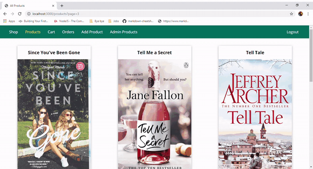

# Shopping cart

In our app, users can buy/sell products. To buy, a user adds items to his/her cart, pays online, and views his/her invoices. To sell a product, s/he adds its title, image, price, and short description.

## Design
- The web application is built with MVC architecture.

- It relies on Express to navigate between views and handle dynamic routes, EJS as a templating language to render views' dynamic content, Mongoose ODM to access MongoDB, and stripe for online payment.

- The app provides sessions, authentication, and server-side validations for users. It is protected from cross-site request forgery (CSRF) attacks and routes are protected from access by unauthorized users. Encrypted passwords are stored in database.

- The app sends a mail to its user to confirm his/her signup or to reset his/her password.

- Products are displayed in the shop via a responsive pagination and deleted by users through asynchronous requests and DOM manipulation.

- Invoices for users' orders are generated by PDFKit library.

## Demo

## Run
- In the app's root directory, create two folders: data/invoices and images.

- For MongoDB access, replace \<username\> and \<password\> at line 18 in app.js with yours:

      const MONGODB_URI = 'mongodb+srv://<username>:<password>@cluster0-rbjdo.mongodb.net/shop';

- For stripe's payment, replace both test API keys:  publishable key in views/shop/checkout.ejs at line 23 and secret key in controllers/shop.js at line 5.

- Replace SendGrid's API key in controllers/auth.js at line 12.

- Navigate to the app's root directory at the terminal and run the following commands:

      npm install bcryptjs body-parser connect-flash connect-mongodb-session csurf ejs express express-session
              express-validator mongodb mongoose multer nodemailer nodemailer-sendgrid-transport pdfkit stripe
      node app.js

- In your browser, visit:

      http://localhost:3000/
